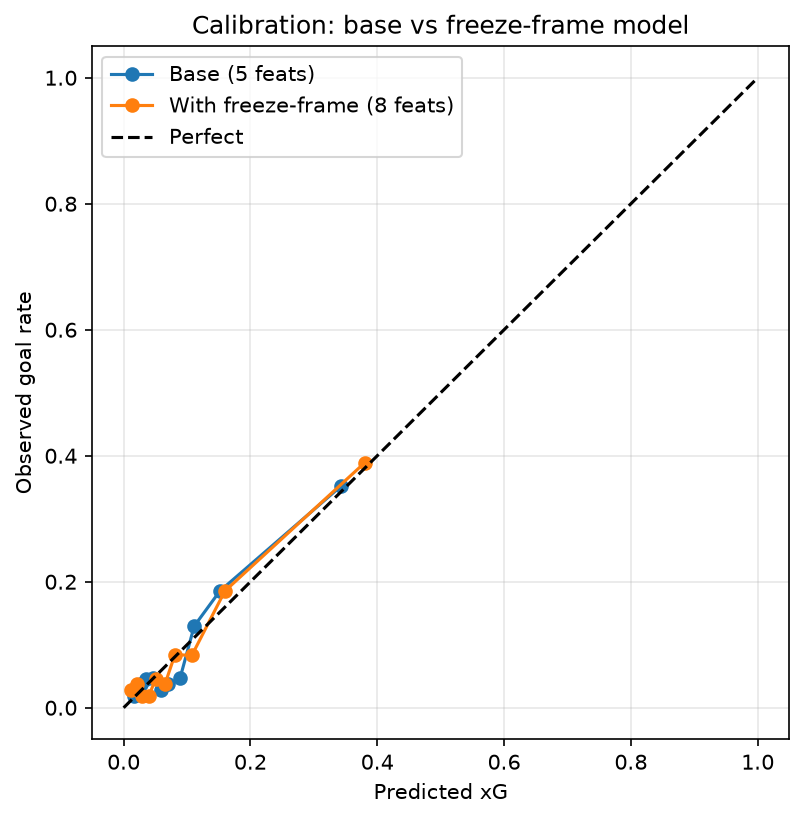
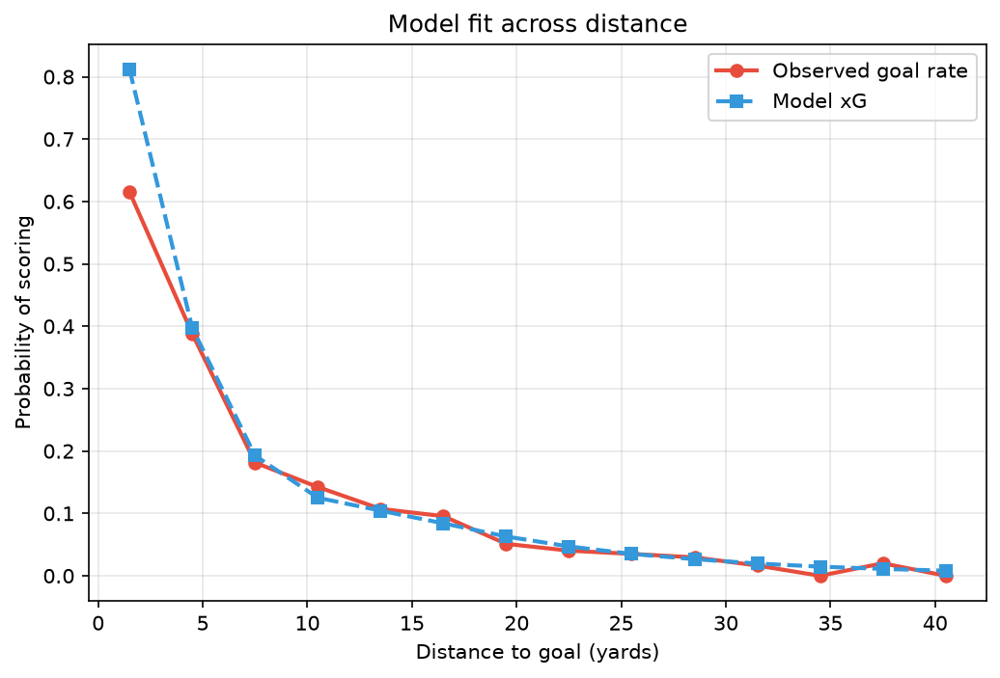
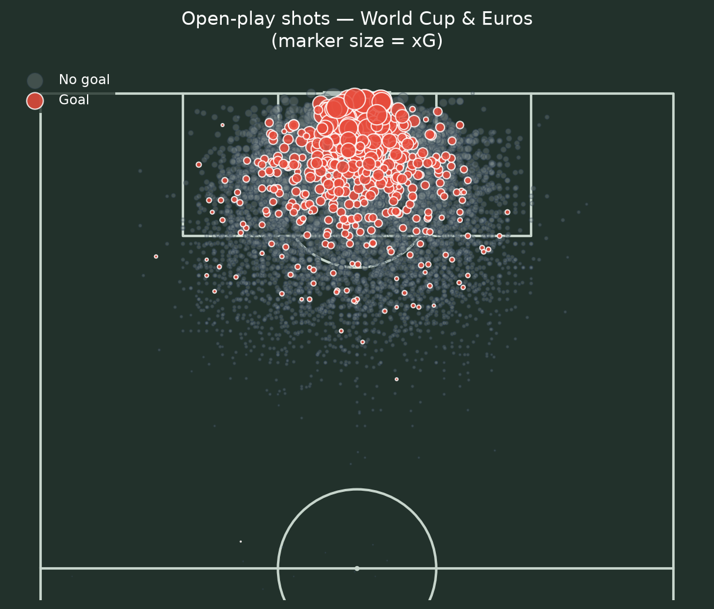
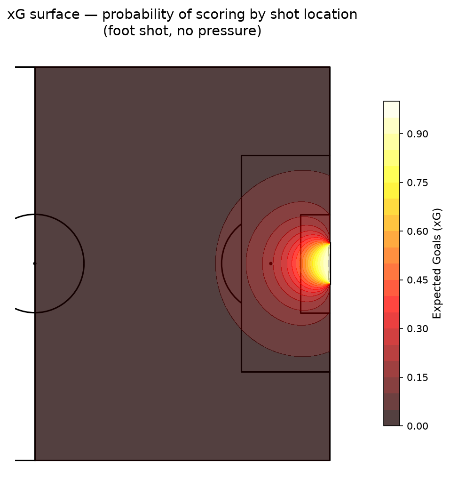
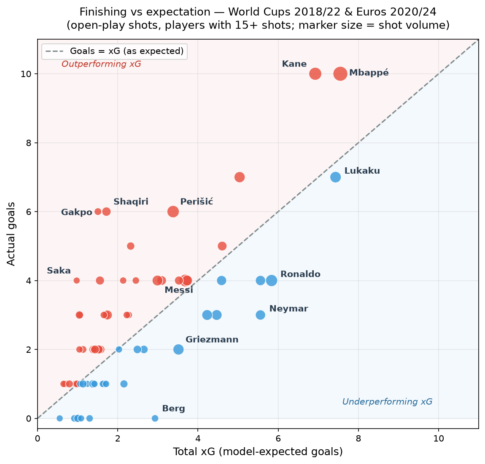

# Expected Goals (xG) Model — International Tournament Football

An expected-goals model built from open event data, with an interactive web app that lets you
place defenders on the pitch and watch the xG update in real time.

**[▶ Try the live app](https://myrepo-me8g453r7cfz5pw2xspkdu.streamlit.app/)**

---

## What this is

Expected Goals (xG) estimates the probability that a given shot is scored, based on the situation
it was taken from. It is the standard way football analysts separate **chance quality** from
**finishing** — a 0-1 defeat where you created 2.8 xG tells a very different story from a 0-1
defeat where you created 0.3.

This project builds an xG model from scratch on 5,388 open-play shots, evaluates it with the
metrics that actually matter for a probability model, and turns it into a tool other people can use.

## Data

| | |
|---|---|
| Source | [StatsBomb Open Data](https://github.com/statsbomb/open-data) |
| Competitions | FIFA World Cup 2018 & 2022, UEFA Euro 2020 & 2024 |
| Shots (raw) | 5,829 |
| Shots (open play, modelled) | 5,388 |
| Goals | 498 |
| Base scoring rate | 9.2% |

Penalties (223), free kicks (212) and direct corners (6) are **excluded**. Their scoring mechanics
are fundamentally different — penalties convert at roughly 75% versus ~9% for open play — and
mixing them in distorts what the model learns about shot location.

Every shot in the sample has a StatsBomb `freeze_frame`: a snapshot of every player's position at
the moment the shot was taken. That's what makes the defensive features below possible.

## Features

**Geometry**
- `distance` — distance from the shot to the centre of the goal
- `angle` — the angular width of the goal as seen from the shot location. Two shots can be the same
  distance out but have very different chances if one is from a tight angle near the byline.

**Shot context**
- `is_head` — headers convert at a lower rate than shots with the foot
- `under_pressure` — a defender actively closing the shooter down
- `first_time` — struck without controlling the ball first

**Defensive positioning (from freeze-frame)**
- `n_blockers` — defenders inside the triangle formed by the shot location and the two posts
- `nearest_def_dist` — distance to the closest defender
- `gk_dist_to_goal` — how far the goalkeeper has come off the goal line

The blocker count alone is strongly informative:

| Defenders in the shot cone | Shots | Scoring rate |
|---|---|---|
| 0 | 2,606 | 12.8% |
| 1 | 1,916 | 6.7% |
| 2 | 613 | 4.6% |
| 3 | 191 | 3.1% |
| 4+ | 62 | 1.6% |

Each additional defender in the way roughly halves the chance of scoring.

## Models and results

Two models were trained on an 80/20 stratified split and compared on the same held-out set.

| Model | Features | ROC-AUC | Log loss | Brier |
|---|---|---|---|---|
| Logistic regression | 5 (geometry + context) | 0.772 | 0.2586 | 0.0716 |
| **Logistic regression** | **8 (+ freeze-frame)** | **0.795** | **0.2482** | **0.0686** |
| XGBoost | 8 (+ freeze-frame) | 0.781 | 0.2575 | 0.0689 |

Two things are worth drawing out.

**Adding the defensive features improved every metric.** The gain came from better inputs, not a
more complicated model — AUC rose from 0.772 to 0.795 purely by describing the situation more
completely.

**Logistic regression beat gradient-boosted trees.** This isn't an accident, and it's the most
interesting result here. The relationship between distance/angle and log-odds of scoring is close
to monotonic and smooth, so there isn't much non-linear interaction for a tree ensemble to exploit.
With ~4,300 training rows and only ~400 positives, XGBoost has far more capacity than the data can
support, and it fits noise. Logistic regression also produces well-calibrated probabilities by
construction, which matters more here than raw discrimination. **Model complexity should match the
structure of the problem and the size of the data, not be maximised by default.**

Standardised coefficients from the final model:

| Feature | Coefficient |
|---|---|
| distance | −0.707 |
| angle | +0.455 |
| n_blockers | −0.378 |
| gk_dist_to_goal | +0.269 |
| is_head | −0.256 |
| nearest_def_dist | +0.224 |
| under_pressure | −0.099 |
| first_time | +0.023 |

Every sign matches football intuition: closer and wider-angle shots are better, headers and blocked
shots are worse, and a goalkeeper caught off his line makes scoring easier.

One detail worth noting — `under_pressure` weakened from −0.177 to −0.099 once `nearest_def_dist`
was added. The continuous distance measure captures the same idea more precisely, so the boolean
flag's contribution is partly absorbed.

## Evaluation

**Accuracy is not used anywhere in this project, deliberately.** Goals are a rare event (~9% of
shots). A model that predicts "no goal" every single time would be 91% accurate and completely
worthless. What matters for xG is whether the predicted *probabilities* are trustworthy.

**Calibration.** If the model says a set of shots are worth 0.30 xG each, roughly 30% of them
should be scored. The curve tracks the diagonal closely across the range where data actually exists.



The curve stops around 0.4 because open-play chances worth more than that essentially don't occur —
that's a property of football, not a gap in the model.

**Aggregate check.** Summed xG should approximate observed goals.

| | Goals |
|---|---|
| Actual (test set) | 100 |
| Predicted xG (final model) | 102.1 |

A 2% discrepancy over 1,078 shots.

**Fit across distance.** Predicted and observed scoring rates by distance band:



The two lines track each other closely except at very short range, where the model *overestimates*
(0.81 predicted vs 0.61 observed in the 0–3 yard band). This is a real limitation rather than a bug:
shots from that close are often scrambled rebounds or off-balance stabs in a crowded six-yard box,
and distance alone doesn't capture that chaos.

## Visualisations

**Shot map** — every open-play shot, sized by xG, with goals highlighted.



**xG surface** — what the model has actually learned, mapped across the pitch for a standard footed
shot with no pressure.



Note how the high-value region hugs the centre of the box and falls away sharply near the byline
even at short range. That's the angle feature doing its work: from a tight angle, most of the goal
is simply not visible.

## From metric to insight: finishing performance

A model is only useful if it answers a question someone cares about. Comparing a player's actual
goals against their accumulated xG separates **finishing** from **chance quality** — did they score
more than the average player would have from the same chances?



Players with 15+ open-play shots. Points above the diagonal outscored their chances.

**Outperforming**

| Player | Shots | Goals | xG | G − xG |
|---|---|---|---|---|
| Cody Gakpo | 18 | 6 | 1.51 | +4.49 |
| Xherdan Shaqiri | 27 | 6 | 1.72 | +4.28 |
| Harry Kane | 53 | 10 | 6.92 | +3.08 |
| Kylian Mbappé | 70 | 10 | 7.55 | +2.45 |

**Underperforming**

| Player | Shots | Goals | xG | G − xG |
|---|---|---|---|---|
| Neymar | 55 | 3 | 5.56 | −2.56 |
| Marcus Berg | 17 | 0 | 2.93 | −2.93 |
| Cristiano Ronaldo | 58 | 4 | 5.84 | −1.84 |
| Antoine Griezmann | 40 | 2 | 3.51 | −1.51 |

Reading these responsibly matters more than the numbers themselves:

- **Kane and Mbappé are the most credible signals.** They combine the highest shot volumes in the
  sample with substantial overperformance — that combination is much harder to produce by chance
  than a large residual on 18 shots.
- **Gakpo and Shaqiri's numbers come from low-xG shots** (0.08 and 0.06 xG per shot — they shoot
  from distance and tight angles). Overperformance on long shots is exactly where variance is
  largest, and both have small samples.
- **Underperformance is not the same as poor finishing.** Star players attract concentrated marking
  and generally have more licence to shoot from poor positions. Separating "took harder chances than
  the model realises" from "missed makeable ones" needs richer context than this model has.
- **Four tournaments is not enough to establish finishing skill.** The literature suggests the signal
  takes several seasons of shots to emerge from noise. This table describes *this sample*; it does
  not predict future performance.

## Interactive app

The [Streamlit app](https://myrepo-me8g453r7cfz5pw2xspkdu.streamlit.app/) exposes the model
directly. You can move the shot, switch between foot and header, toggle pressure, and — the part
that makes the defensive features tangible — **place individual defenders by coordinate** and see
how blockers, the nearest defender and goalkeeper positioning move the number.

A second tab holds the finishing table with an adjustable minimum-shots filter.

The point of building this was communication rather than modelling: a stakeholder who won't read a
notebook will happily drag a defender around and discover for themselves why a shot from the byline
is worth less than one from the penalty spot.

## Repository

```
├── app.py                  # Streamlit application
├── fetch_shots.py          # Pull shot events from StatsBomb open data
├── build_model.py          # Cleaning and geometric feature engineering
├── add_ff_features.py      # Freeze-frame defensive features
├── train_model_v2.py       # Model comparison and evaluation
├── visualize.py            # Shot map, xG surface, distance fit
├── top_finishers.py        # Goals − xG finishing table
├── plot_finishers.py       # Finishing scatter plot
├── xg_model_final.pkl      # Trained model
├── finishing_table.csv     # Per-player aggregates
└── requirements.txt
```

Reproduce from scratch:

```bash
pip install -r requirements.txt
python fetch_shots.py        # takes a few minutes — one API call per match
python build_model.py
python add_ff_features.py
python train_model_v2.py
streamlit run app.py
```

## Limitations and next steps

**Known limitations**

- No information about *where in the goal* the shot was aimed, or the quality of the strike.
- Goalkeeper positioning is reduced to distance off the line; lateral positioning relative to the
  shot angle is not modelled.
- Fast breaks and set-piece phases are pooled with settled attacking play, though the defensive
  organisation differs substantially.
- The model overestimates very close-range shots, as shown above.
- Trained on international tournament football only — it may not transfer cleanly to club football,
  where playing styles and defensive structures differ.

**Next steps**

- Use the full freeze-frame geometry: goalkeeper lateral offset relative to the shot line, and
  whether the nearest defender is genuinely goal-side.
- Model shot types separately rather than pooling them.
- Validate out-of-sample by holding out an entire tournament, rather than splitting shots randomly.
- Extend beyond shot valuation towards possession-value models (xT / EPV), which price passes and
  carries rather than only the final action.

---

*Data: [StatsBomb Open Data](https://github.com/statsbomb/open-data), used under their terms.
Built with pandas, scikit-learn, XGBoost, mplsoccer and Streamlit.*
